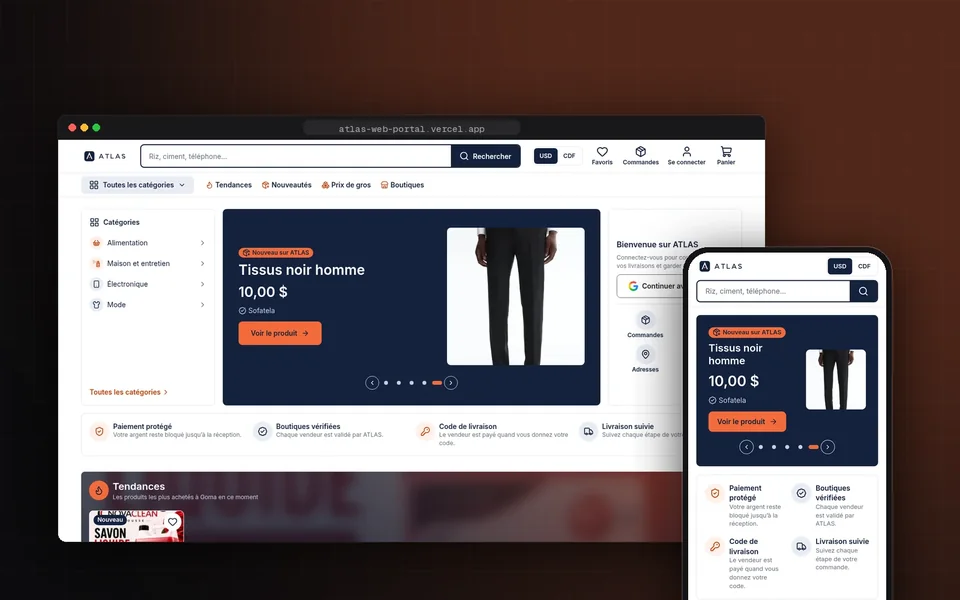
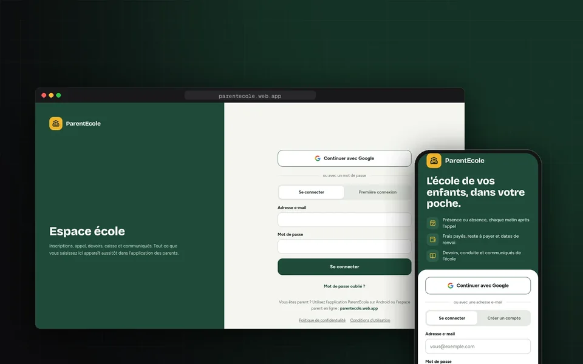
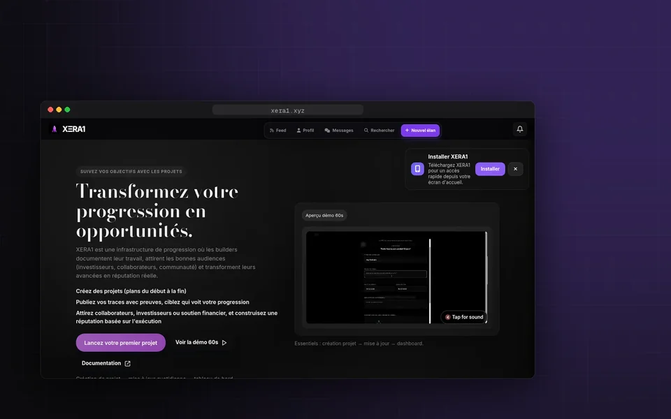
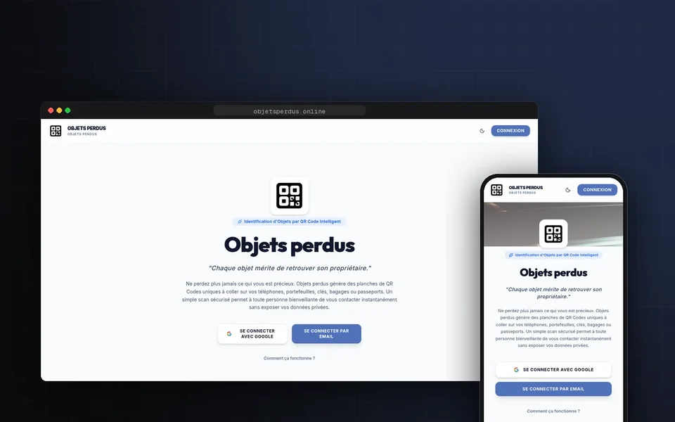
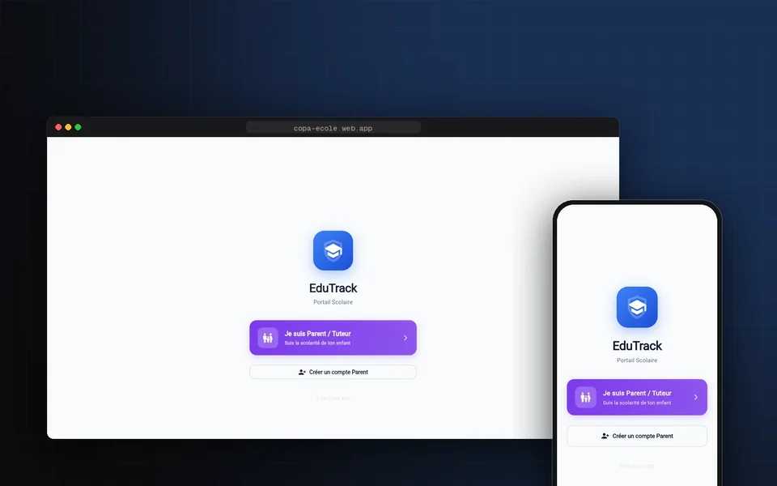
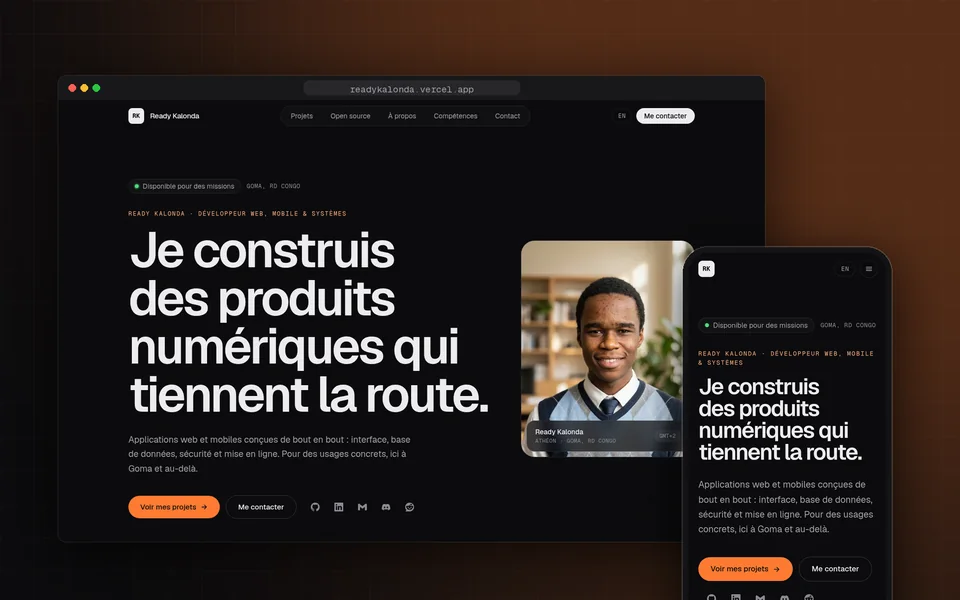

 

  <a href="https://readykalonda.vercel.app"><picture><source media="(prefers-color-scheme: dark)" srcset="https://raw.githubusercontent.com/atheon006/atheon006/main/assets/links/portfolio-dark.svg"></picture></a>
  <a href="https://www.linkedin.com/in/ready-kalonda-a8665a428/"><picture><source media="(prefers-color-scheme: dark)" srcset="https://raw.githubusercontent.com/atheon006/atheon006/main/assets/links/linkedin-dark.svg"></picture></a>
  <a href="mailto:readykalonda38@gmail.com"><picture><source media="(prefers-color-scheme: dark)" srcset="https://raw.githubusercontent.com/atheon006/atheon006/main/assets/links/email-dark.svg"></picture></a>
  <a href="https://discord.gg/2vZm74bM8"><picture><source media="(prefers-color-scheme: dark)" srcset="https://raw.githubusercontent.com/atheon006/atheon006/main/assets/links/discord-dark.svg"></picture></a>
  <a href="https://www.reddit.com/user/Some_Reception9198/"><picture><source media="(prefers-color-scheme: dark)" srcset="https://raw.githubusercontent.com/atheon006/atheon006/main/assets/links/reddit-dark.svg"></picture></a>

 

Je suis **Ready Kalonda**, alias **Athéon**, développeur à **Goma, en RD Congo**. Je conçois et mets en ligne des applications web et mobiles complètes : interface, base de données, sécurité et déploiement. Ce qui me motive, c’est de partir d’un besoin réel, comme le lien entre une école et les parents ou une marketplace pour les boutiques de ma ville, et d’en faire un produit qui marche aussi bien sur un téléphone d’entrée de gamme que sur un ordinateur.

## En ce moment

- **CTO de [ParentEcole](https://parentecole.web.app)** : le lien entre l’école et les parents, en temps réel, sur Android et sur le web.
- **CTO de [XERA1](https://xera1.xyz)** : la plateforme où les créateurs transforment leur progression en opportunités.
- **Cofondateur d’[Objets perdus](https://objetsperdus.online)** : des étiquettes QR pour qu’un objet perdu retrouve son propriétaire.
- **Je construis [ATLAS](https://atlas-web-portal.vercel.app)** : la marketplace des boutiques vérifiées de Goma, avec paiement protégé jusqu’à la livraison.

<b>English version</b>

 

I’m **Ready Kalonda**, also known as **Athéon**, a developer based in **Goma, DR Congo**. I design and ship complete web and mobile applications: interface, database, security and deployment. What drives me is taking a real need, like the link between a school and parents or a marketplace for the shops in my city, and turning it into a product that works on an entry-level phone as well as on a desktop.

- **CTO of [ParentEcole](https://parentecole.web.app)**: the link between school and parents, in real time, on Android and the web.
- **CTO of [XERA1](https://xera1.xyz)**: the platform where builders turn their progress into opportunities.
- **Co-founder of [Objets perdus](https://objetsperdus.online)**: QR labels that help lost items find their way home.
- **Building [ATLAS](https://atlas-web-portal.vercel.app)**: the marketplace for verified shops in Goma, with payment held until delivery.

The full portfolio is available in English at [readykalonda.vercel.app](https://readykalonda.vercel.app) (EN button).

## Projets

<table>
<tr>
<td width="50%" valign="top">

### ATLAS <picture><source media="(prefers-color-scheme: dark)" srcset="https://raw.githubusercontent.com/atheon006/atheon006/main/assets/badges/beta-dark.svg"></picture>

**Conception et développement** · la marketplace des boutiques vérifiées de Goma. Le client paie par Mobile Money, l’argent reste bloqué jusqu’à ce que le destinataire donne son code au livreur. Site client, app Flutter et espace d’administration.

`React` `TypeScript` `Supabase` `Flutter`

[Marketplace ↗](https://atlas-web-portal.vercel.app) · [Démo ↗](https://atlas-web-psi-pied.vercel.app) · [Étude de cas ↗](https://readykalonda.vercel.app/projects/atlas)

</td>
<td width="50%" valign="top">

### ParentEcole <picture><source media="(prefers-color-scheme: dark)" srcset="https://raw.githubusercontent.com/atheon006/atheon006/main/assets/badges/live-dark.svg"></picture>

**CTO** · le lien entre l’école et les parents, en temps réel. Présences, frais et dates de renvoi, devoirs et conduite sur Android et sur le web ; un site par rôle pour l’école, avec double authentification du personnel.

`React` `TypeScript` `Capacitor` `Firebase`

[Espace parent ↗](https://parentecole.web.app) · [Espace école ↗](https://parentecole-app.web.app) · [Code](https://github.com/atheon006/ecoleparent) · [Étude de cas ↗](https://readykalonda.vercel.app/projects/parentecole)

</td>
</tr>
<tr>
<td width="50%" valign="top">

### XERA1 <picture><source media="(prefers-color-scheme: dark)" srcset="https://raw.githubusercontent.com/atheon006/atheon006/main/assets/badges/live-dark.svg"></picture>

**CTO** · les créateurs documentent leur travail, publient des preuves de leur progression et attirent collaborateurs et investisseurs. J’ai porté la migration vers React (Vite), le déploiement Vercel, les données Supabase et l’application installable.

`React` `Vite` `Supabase` `Vercel`

[Site ↗](https://xera1.xyz) · [Code](https://github.com/GIBRILmadak/XERA1) · [Étude de cas ↗](https://readykalonda.vercel.app/projects/xera1)

</td>
<td width="50%" valign="top">

### Objets perdus <picture><source media="(prefers-color-scheme: dark)" srcset="https://raw.githubusercontent.com/atheon006/atheon006/main/assets/badges/live-dark.svg"></picture>

**Cofondateur** · des planches de QR codes uniques à coller sur ses affaires. La personne qui trouve l’objet scanne le code et contacte le propriétaire, sans jamais voir ses données personnelles.

`React` `Firebase` `Vercel`

[Site ↗](https://objetsperdus.online) · [Étude de cas ↗](https://readykalonda.vercel.app/projects/objets-perdus)

</td>
</tr>
<tr>
<td width="50%" valign="top">

### EduTrack <picture><source media="(prefers-color-scheme: dark)" srcset="https://raw.githubusercontent.com/atheon006/atheon006/main/assets/badges/live-dark.svg"></picture>

**Développement et mise en production** · gestion scolaire en Flutter : une seule base de code pour l’APK Android et l’application web installable, avec notifications push et construction automatique. Reprise d’un projet open source d’Ash469.

`Flutter` `Dart` `Firebase` `GitHub Actions`

[Application web ↗](https://copa-ecole.web.app) · [Code](https://github.com/atheon006/EduTrack-2.2) · [Étude de cas ↗](https://readykalonda.vercel.app/projects/edutrack)

</td>
<td width="50%" valign="top">

### Portfolio <picture><source media="(prefers-color-scheme: dark)" srcset="https://raw.githubusercontent.com/atheon006/atheon006/main/assets/badges/live-dark.svg"></picture>

**Design et développement** · mon site en français et en anglais : chaque projet avec ses vraies captures, son rôle et sa stack, et des données structurées pour que Google relie mes comptes.

`Astro` `Tailwind CSS` `TypeScript` `Vercel`

[Site ↗](https://readykalonda.vercel.app) · [Code](https://github.com/atheon006/Ready)

</td>
</tr>
</table>

### Autres réalisations

| Projet | En bref | Liens |
| --- | --- | --- |
| **ARENA** | Prototype Angular connecté à l’IA Gemini, avec rendu côté serveur. | [Code](https://github.com/atheon006/ARENA-V3) |
| **Shinobi no Sato** | Quiz et duels en temps réel pour fans d’anime et de manga, avec classement et carte « Otaku ID ». | Code privé |
| **Portfolio v1** | Ma première vitrine : typographie forte et animations GSAP au défilement. | [Site ↗](https://portfolioready.vercel.app) · [Code](https://github.com/atheon006/portfolio-Ready-du-copa) |

## Open source

Des projets d’autres développeurs que j’ai modifiés ou que j’utilise au quotidien.

| Projet | Ce que c’est | Ce que j’en fais |
| --- | --- | --- |
| **[Arcane-Ops](https://github.com/atheon006/Arcane-Ops)** fork de [apexinfinity243/Arcane-Ops](https://github.com/apexinfinity243/Arcane-Ops) | App Flutter de connexion et de messagerie, au thème inspiré de Matrix. | Remise en état de la compilation Android, configuration Firebase, notifications et intégration continue. |
| **[serpantinum](https://github.com/ilyamiro/serpantinum)** par ilyamiro | Interface de bureau pour Hyprland et les compositeurs Wayland, écrite en QML. | Mon environnement de bureau sous Linux. |
| **[Midnight-Disk-Jocky](https://github.com/lostlight-commits/Midnight-Disk-Jocky)** par lostlight-commits | Bot musical Discord auto-hébergé : YouTube, Spotify et radios. | Auto-hébergé et utilisé sur mon serveur Discord. |

## Stack

<picture>
  <source media="(prefers-color-scheme: dark)" srcset="https://raw.githubusercontent.com/atheon006/atheon006/main/assets/stack-dark.svg">
  
</picture>

## Activité

<picture>
  <source media="(prefers-color-scheme: dark)" srcset="https://raw.githubusercontent.com/atheon006/atheon006/output/stats-dark.svg">
  
</picture>

<picture>
  <source media="(prefers-color-scheme: dark)" srcset="https://raw.githubusercontent.com/atheon006/atheon006/output/snake-dark.svg">
  
</picture>

 
 

Visuels générés par <a href="scripts/build.py">scripts/build.py</a> · statistiques et serpent mis à jour chaque jour par GitHub Actions

